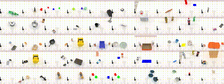
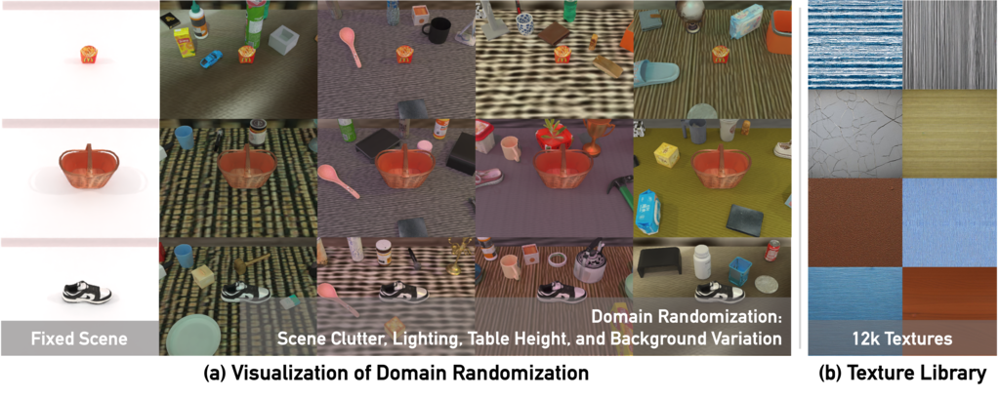

<h1 align="center">
  <a href="https://robotwin-benchmark.github.io"><b>RoboTwin</b> Bimanual Robotic Manipulation Simulation Platform<br></a>
  <small>Lastest Version: RoboTwin 2.0</small><br>
</h1>

🤲 <a href="https://robotwin-platform.github.io/">Webpage</a> | <a href="https://robotwin-platform.github.io/doc/">Document</a> | <a href="https://robotwin-platform.github.io/doc/community/index.html">Community</a>
<br>

https://private-user-images.githubusercontent.com/88101805/457546797-95d637f6-685f-416c-afa7-c9258cdc304d.mp4

**[2.0 Version (lastest)]** RoboTwin 2.0: A Scalable Data Generator and Benchmark with Strong Domain Randomization for Robust Bimanual Robotic Manipulation<br>
<i>Under Review 2025</i>: [PDF](https://robotwin-platform.github.io/paper.pdf) | [arXiv (Coming Soon)]()<br>
> <a href="https://tianxingchen.github.io/">Tianxing Chen</a>, Zanxin Chen, Baijun Chen, Zijian Cai, <a href="https://10-oasis-01.github.io">Yibin Liu</a>, <a href="https://kolakivy.github.io/">Qiwei Liang</a>, Zixuan Li, Xianliang Lin, <a href="https://geyiheng.github.io">Yiheng Ge</a>, Zhenyu Gu, Weiliang Deng, Yubin Guo, Tian Nian, Xuanbing Xie, <a href="https://www.linkedin.com/in/yusen-qin-5b23345b/">Qiangyu Chen</a>, Kailun Su, Tianling Xu, <a href="http://luoping.me/">Guodong Liu</a>, <a href="https://aaron617.github.io/">Mengkang Hu</a>, <a href="https://c7w.tech/about">Huan-ang Gao</a>, Kaixuan Wang, <a href="https://liang-zx.github.io/">Zhixuan Liang</a>, <a href="https://www.linkedin.com/in/yusen-qin-5b23345b/">Yusen Qin</a>, Xiaokang Yang, <a href="http://luoping.me/">Ping Luo</a>, <a href="https://yaomarkmu.github.io/">Yao Mu</a>


**[RoboTwin Dual-Arm Collaboration Challenge@CVPR'25 MEIS Workshop]** RoboTwin Dual-Arm Collaboration Challenge Technical Report at CVPR 2025 MEIS Workshop<br>
> Coming Soon.

**[1.0 Version]** RoboTwin: Dual-Arm Robot Benchmark with Generative Digital Twins<br>
Accepted to <i style="color: red; display: inline;"><b>CVPR 2025 (Highlight)</b></i>: [PDF](https://arxiv.org/pdf/2504.13059) | [arXiv](https://arxiv.org/abs/2504.13059)<br>
> <a href="https://yaomarkmu.github.io/">Yao Mu</a><sup>* †</sup>, <a href="https://tianxingchen.github.io">Tianxing Chen</a><sup>* </sup>, Zanxin Chen<sup>* </sup>, <a href="https://shijiapeng03.github.io">Shijia Peng</a><sup>* </sup>, Zhiqian Lan, Zeyu Gao, Zhixuan Liang, Qiaojun Yu, Yude Zou, Mingkun Xu, Lunkai Lin, Zhiqiang Xie, Mingyu Ding, <a href="http://luoping.me/">Ping Luo</a><sup>†</sup>.

**[Early Version]** RoboTwin: Dual-Arm Robot Benchmark with Generative Digital Twins (early version)<br>
Accepted to <i style="color: red; display: inline;"><b>ECCV Workshop 2024 (Best Paper Award)</b></i>: [PDF](https://arxiv.org/pdf/2409.02920) | [arXiv](https://arxiv.org/abs/2409.02920)<br>
> <a href="https://yaomarkmu.github.io/">Yao Mu</a><sup>* †</sup>, <a href="https://tianxingchen.github.io">Tianxing Chen</a><sup>* </sup>, Shijia Peng<sup>*</sup>, Zanxin Chen<sup>*</sup>, Zeyu Gao, Zhiqian Lan, Yude Zou, Lunkai Lin, Zhiqiang Xie, <a href="http://luoping.me/">Ping Luo</a><sup>†</sup>.


# 📚 Overview

| Branch Name | Link |
|-------------|------|
| 2.0 Version Branch | [main](https://github.com/RoboTwin-Platform/RoboTwin/tree/main) (latest) |
| 1.0 Version Branch | [1.0 Version](https://github.com/RoboTwin-Platform/RoboTwin/tree/main) |
| 1.0 Version Code Generation Branch | [1.0 Version GPT](https://github.com/RoboTwin-Platform/RoboTwin/tree/gpt) |
| Early Version Branch | [Early Version](https://github.com/RoboTwin-Platform/RoboTwin/tree/early_version) |
| 第十九届“挑战杯”人工智能专项赛分支 | Coming Soon... |
| CVPR 2025 Challenge Round 1 Branch | [CVPR-Challenge-2025-Round1](https://github.com/RoboTwin-Platform/RoboTwin/tree/CVPR-Challenge-2025-Round1) |
| CVPR 2025 Challenge Round 2 Branch | [CVPR-Challenge-2025-Round2](https://github.com/RoboTwin-Platform/RoboTwin/tree/CVPR-Challenge-2025-Round2) |


# 🐣 Update
* **2025/06/21**, We release RoboTwin 2.0 !
* **2025/04/11**, RoboTwin is seclected as <i>CVPR Highlight paper</i>!
* **2025/02/27**, RoboTwin is accepted to <i>CVPR 2025</i> ! 
* **2024/09/30**, RoboTwin (Early Version) received <i>the Best Paper Award  at the ECCV Workshop</i>!
* **2024/09/20**, Officially released RoboTwin.

<!-- **Applications and extensions of RoboTwin from the community:**

[TODO]

[[arXiv 2411.18369](https://arxiv.org/abs/2411.18369)], <i>G3Flow: Generative 3D Semantic Flow for Pose-aware and Generalizable Object Manipulation</i>, where 5 RoboTwin tasks are selected for benchmarking. -->

# 🛠️ Installation

See [INSTALL.md](https://robotwin-platform.github.io/doc/usage/robotwin-install.html) for installation instructions. It takes about 20 minutes for installation.

# 🤷‍♂️ Tasks Informations
See [RoboTwin 2.0 Tasks Doc](https://robotwin-platform.github.io/doc/tasks/index.html) for more details.

<p align="center">
  
</p>

# 🧑🏻‍💻 Usage 

> Please Refer to [RoboTwin 2.0 Document (Usage Part)](https://robotwin-platform.github.io/doc/usage/index.html) for more details.

## Data Collection
We provide over 100,000 pre-collected trajectories as part of the open-source release [RoboTwin Dataset](https://huggingface.co/datasets/TianxingChen/RoboTwin2.0/tree/main/dataset).
However, we strongly recommend users to perform data collection themselves due to the high configurability and diversity of task and embodiment setups.



## 1. Task Running and Data Collection
Running the following command will first search for a random seed for the target collection quantity, and then replay the seed to collect data.

```
bash collect_data.sh ${task_name} ${task_config} ${gpu_id}
# Example: bash collect_data.sh beat_block_hammer demo_randomized 0
```

## 2. Task Config
See [RoboTwin 2.0 Tasks Configurations Doc](https://robotwin-platform.github.io/doc/usage/configurations.html) for more details.

# 🚴‍♂️ Policy Baselines
## Policies Support
[DP](https://robotwin-platform.github.io/doc/usage/DP.html), [ACT](https://robotwin-platform.github.io/doc/usage/ACT.html), [DP3](https://robotwin-platform.github.io/doc/usage/DP3.html), [RDT](https://robotwin-platform.github.io/doc/usage/RDT.html), [PI0](https://robotwin-platform.github.io/doc/usage/Pi0.html)

[TinyVLA](https://robotwin-platform.github.io/doc/usage/TinyVLA.html), [DexVLA](https://robotwin-platform.github.io/doc/usage/DexVLA.html) (Contributed by Media Group)

Deploy Your Policy: [guide](https://robotwin-platform.github.io/doc/usage/deploy-your-policy.html)

⏰ TODO: G3Flow, HybridVLA, DexVLA, OpenVLA-OFT, SmolVLA, AVR, UniVLA

# 🏄‍♂️ Experiment & LeaderBoard

> We recommend that the RoboTwin Platform can be used to explore the following topics: 
> 1. single - task fine - tuning capability
> 2. visual robustness
> 3. language diversity robustness (language condition)
> 4. multi-tasks capability
> 5. cross-embodiment performance

Coming Soon.

# 👍 Citations
If you find our work useful, please consider citing:

<b>RoboTwin 2.0</b>: A Scalable Data Generator and Benchmark with Strong Domain Randomization for Robust Bimanual Robotic Manipulation
```
Coming Soon.
```

<b>RoboTwin</b>: Dual-Arm Robot Benchmark with Generative Digital Twins, accepted to <i style="color: red; display: inline;"><b>CVPR 2025 (Highlight)</b></i>
```
@InProceedings{Mu_2025_CVPR,
    author    = {Mu, Yao and Chen, Tianxing and Chen, Zanxin and Peng, Shijia and Lan, Zhiqian and Gao, Zeyu and Liang, Zhixuan and Yu, Qiaojun and Zou, Yude and Xu, Mingkun and Lin, Lunkai and Xie, Zhiqiang and Ding, Mingyu and Luo, Ping},
    title     = {RoboTwin: Dual-Arm Robot Benchmark with Generative Digital Twins},
    booktitle = {Proceedings of the Computer Vision and Pattern Recognition Conference (CVPR)},
    month     = {June},
    year      = {2025},
    pages     = {27649-27660}
}
```

<b>RoboTwin</b>: Dual-Arm Robot Benchmark with Generative Digital Twins (early version), accepted to <i style="color: red; display: inline;"><b>ECCV Workshop 2024 (Best Paper Award)</b></i>
```
@article{mu2024robotwin,
  title={RoboTwin: Dual-Arm Robot Benchmark with Generative Digital Twins (early version)},
  author={Mu, Yao and Chen, Tianxing and Peng, Shijia and Chen, Zanxin and Gao, Zeyu and Zou, Yude and Lin, Lunkai and Xie, Zhiqiang and Luo, Ping},
  journal={arXiv preprint arXiv:2409.02920},
  year={2024}
}
```

# 😺 Acknowledgement

**Software Support**: D-Robotics, **Hardware Support**: AgileX Robotics, **AIGC Support**: Deemos

Code Style: `find . -name "*.py" -exec sh -c 'echo "Processing: {}"; yapf -i --style='"'"'{based_on_style: pep8, column_limit: 120}'"'"' {}' \;`

Contact [Tianxing Chen](https://tianxingchen.github.io) if you have any questions or suggestions.

# 🏷️ License
This repository is released under the MIT license. See [LICENSE](./LICENSE) for additional details.